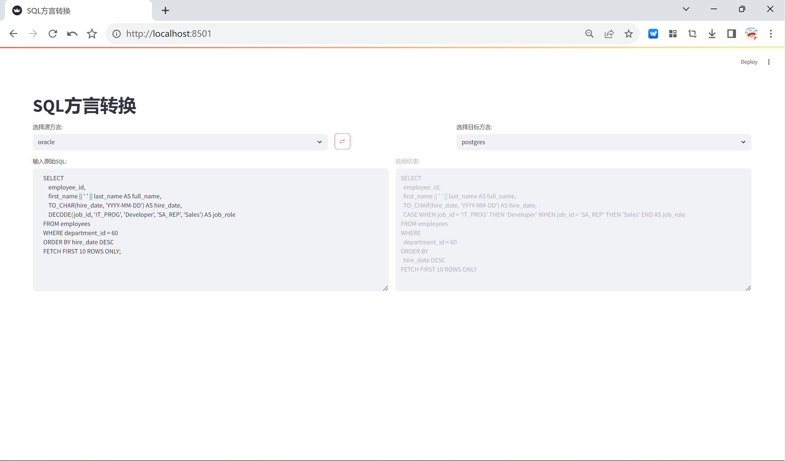

# SQL 方言转换工具

本项目是一个基于 SQLGlot 和 LLM（大型语言模型）增强的 SQL 方言转换工具。它旨在帮助用户将不同数据库系统的 SQL 语句转换为目标方言，特别是在处理复杂的 SQL 结构（如 PL/SQL 块、动态 SQL 等）时提供更强大的能力。

## 功能特性

- **基于 SQLGlot 的基础转换**: 利用 SQLGlot 库进行标准的 SQL 方言转换。
- **LLM 增强处理**: 对于 SQLGlot 难以直接处理的复杂结构（如 PL/SQL 存储过程、函数、匿名块、动态 SQL 等），调用 LLM 进行辅助转换。
- **支持多种方言**: 支持广泛的 SQL 方言转换。
- **保留注释和格式**: 在转换过程中尽量保留原始 SQL 的行注释、块注释和空行。

## 支持的 SQL 方言

本项目支持以下 SQL 方言之间的转换：

- athena
- bigquery
- clickhouse
- databricks
- doris
- drill
- druid
- duckdb
- dune
- hive
- materialize
- mysql
- oracle
- postgres
- presto
- prql
- redshift
- risingwave
- snowflake
- spark
- spark2
- sqlite
- starrocks
- tableau
- teradata
- trino
- tsql

## 环境配置

1.  **创建并激活虚拟环境** (推荐使用 `venv` 或 `conda`):

    ```bash
    # 使用 venv
    python -m venv venv
    source venv/bin/activate
    ```

2.  **安装依赖**: 安装 `requirements.txt` 中列出的所有依赖。

    ```bash
    pip install -r requirements.txt
    ```

3.  **配置 LLM API**: 复制 `.env.example` 文件并重命名为 `.env`，然后填入你的 LLM API 的 `base_url` 和 `api_key`。

    ```bash
    cp .env.example .env
    # 编辑 .env 文件，填入你的 LLM 配置
    ```

4.  **运行应用**: 激活虚拟环境后，运行 `app.py` 文件。

    ```bash
    streamlit run app.py
    ```

## 页面截图

以下是应用程序的页面截图：



## 使用方法

1.  在左侧的文本区域输入你想要转换的 SQL 语句。
2.  选择源方言和目标方言。
3.  点击 "⇄" 按钮进行转换。
4.  转换结果将显示在右侧的文本区域。