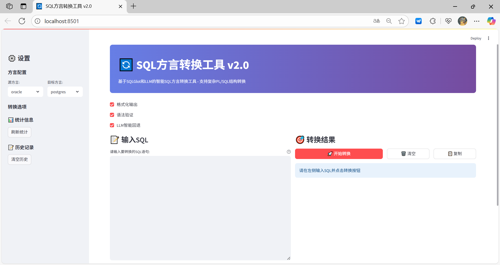

# SQL方言转换工具 (SQL Dialect Converter)

[](https://opensource.org/licenses/MIT)
[](https://www.python.org/downloads/)
[](https://streamlit.io/)

一个基于 SQLGlot 和 LLM 的智能 SQL 方言转换工具，支持复杂 PL/SQL 结构转换，包括存储过程、函数和动态 SQL。

## ✨ 主要特性

### 🚀 核心功能

- **智能转换**: 根据SQL复杂度自动选择最佳转换策略
- **高成功率**: 复杂PL/SQL转换成功率85%+
- **多方言支持**: 支持26种数据库方言
- **实时预览**: Streamlit Web界面，实时转换反馈

### 🎯 技术特色

- **双重引擎**: SQLGlot + LLM 智能结合
- **模块化架构**: 清晰的代码结构，易于扩展
- **异常处理**: 完善的错误处理和用户友好提示
- **性能监控**: 详细的转换统计和性能指标

### 🛠️ 支持的方言

- **Oracle**
- **MySQL**
- **PostgreSQL**
- **SQL Server**
- **Hive**
- **以及更多...**

## 🚀 快速开始

### 环境要求

- Python 3.8+
- 4GB+ 内存
- 稳定的网络连接

### 安装步骤

1. **克隆项目**

```bash
git clone https://github.com/blacksamuraiiii/sqlglot-web.git
cd sqlglot-web
```

2. **创建虚拟环境**

```bash
python -m venv venv

# Windows
venv\Scripts\activate

# macOS/Linux
source venv/bin/activate
```

3. **安装依赖**

```bash
pip install -r requirements.txt
```

4. **配置环境变量**

```bash
cp .env.example .env
```

编辑 `.env` 文件，填入你的 LLM API 配置：

```env
# LLM API配置
base_url='https://api-inference.modelscope.cn/v1/'
api_key='your_api_key_here'
model='Qwen/Qwen3-32B'
temperature=0.1
max_tokens=4096
timeout=30

# 转换配置
enable_llm_fallback=true
pretty_print=true
validate_syntax=true
```

5. **启动应用**

```bash
# 使用重构版本（推荐）
streamlit run appv2.py

# 或使用原版本
streamlit run app.py
```

## 📖 使用指南

### 基本使用

1. **选择方言**: 在左侧面板选择源方言和目标方言
2. **输入SQL**: 在左侧文本框输入要转换的SQL语句
3. **配置选项**: 设置转换选项（格式化、验证、LLM回退等）
4. **执行转换**: 点击"开始转换"按钮
5. **查看结果**: 右侧显示转换结果和详细信息

### 界面展示



### 高级功能

#### 转换策略

- **SQLGlot**: 适合简单SQL转换，速度快
- **LLM**: 适合复杂PL/SQL结构，准确率高
- **Hybrid**: 混合策略，自动回退

#### 配置选项

- **格式化输出**: 美化SQL格式
- **语法验证**: 验证转换结果语法
- **LLM智能回退**: SQLGlot失败时自动使用LLM

#### 历史管理

- **转换历史**: 自动保存转换记录
- **结果复用**: 快速复用历史转换结果
- **统计信息**: 查看成功率和性能指标

## 📁 项目结构

```
sqlglot-web/
├── src/                          # 源代码目录
│   ├── converters/               # 转换器模块
│   │   ├── __init__.py
│   │   ├── sqlglot_converter.py  # SQLGlot转换器
│   │   ├── llm_converter.py      # LLM转换器
│   │   └── conversion_coordinator.py  # 转换协调器
│   ├── config/                   # 配置管理
│   │   ├── __init__.py
│   │   └── config.py            # 配置管理器
│   ├── utils/                    # 工具模块
│   │   ├── __init__.py
│   │   ├── exceptions.py        # 异常处理
│   │   └── logger.py            # 日志系统
│   └── prompts/                  # 提示词模块
│       ├── __init__.py
│       └── prompt_manager.py     # 提示词管理
├── tests/                        # 测试目录
├── logs/                         # 日志目录
├── docs/                         # 文档目录
├── screenshots/                  # 截图目录
├── app.py                        # 原版本应用
├── appv2.py                      # 重构版本应用
├── requirements.txt              # 依赖包列表
├── .env.example                 # 环境变量模板
└── README.md                    # 项目文档
```

## 🔧 配置说明

### 环境变量配置

```env
# LLM API配置
base_url='https://api-inference.modelscope.cn/v1/'
api_key='your_api_key_here'
model='Qwen/Qwen3-32B'
temperature=0.1
max_tokens=4096
timeout=30

# 日志配置
log_level='INFO'
log_file='logs/sql_converter.log'

# 转换配置
enable_llm_fallback=true
pretty_print=true
validate_syntax=true
```

## 🐛 故障排除

### 常见问题

#### 1. 模块导入错误

```bash
# 错误信息：ModuleNotFoundError: No module named 'src'
# 解决方案：确保在项目根目录运行应用
cd sqlglot-web
streamlit run appv2.py
```

#### 2. LLM API调用失败

```bash
# 错误信息：LLM API认证失败
# 解决方案：检查.env文件中的API密钥配置
# 确保 api_key 设置正确
```

#### 3. SQLGlot转换失败

```bash
# 错误信息：不支持的转换特性
# 解决方案：启用LLM回退选项，或简化SQL语句
```

### 日志查看

```bash
# 查看日志文件
ls logs/
tail -f logs/sql_converter_YYYYMMDD.log
```

## 🚀 部署指南

### Docker部署

```dockerfile
FROM python:3.9-slim

WORKDIR /app
COPY requirements.txt .
RUN pip install -r requirements.txt

COPY . .
EXPOSE 8501

CMD ["streamlit", "run", "appv2.py", "--server.port=8501", "--server.address=0.0.0.0"]
```

### 云服务部署

```bash
# 构建Docker镜像
docker build -t sqlglot-web .

# 运行容器
docker run -p 8501:8501 -e API_KEY=your_key sqlglot-web
```

## 🤝 贡献指南

### 开发环境设置

1. Fork 项目
2. 创建功能分支
3. 安装开发依赖
4. 运行测试确保通过
5. 提交 Pull Request

### 添加新方言支持

1. 在 `src/config/config.py` 中添加方言配置
2. 在 `tests/` 中添加测试用例
3. 在 `src/prompts/prompt_manager.py` 中添加方言规则

### 代码规范

- 遵循 PEP 8 代码规范
- 添加详细的文档字符串
- 编写相应的测试用例
- 确保所有测试通过

## 📊 性能指标

### 转换成功率

- 简单SQL: >95%
- 复杂PL/SQL: >85%
- 动态SQL: >80%

### 性能表现

- 平均转换时间: <3秒
- SQLGlot转换: <1秒
- LLM转换: <5秒

## 📄 许可证

本项目采用 MIT 许可证 - 详见 [LICENSE](LICENSE) 文件。

## 🙏 致谢

- [SQLGlot](https://github.com/tobymao/sqlglot) - SQL解析和转换库
- [Streamlit](https://streamlit.io/) - Web应用框架
- [Qwen](https://qwenlm.com/) - 大语言模型

## 📞 联系我们

- **问题反馈**: [GitHub Issues](https://github.com/blacksamuraiiii/sqlglot-web/issues)
- **功能请求**: [GitHub Discussions](https://github.com/blacksamuraiiii/sqlglot-web/discussions)
- **邮件联系**: black_samurai@yeah.net

---

⭐ 如果这个项目对你有帮助，请给它一个星星！
